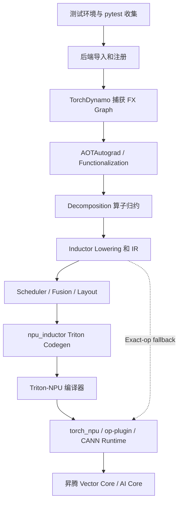

# 昇腾 NPU 新 Inductor 图模式 UT 故障分类与分层治理指南

> 面向 `torch.compile`、PyTorch Inductor、Triton-NPU、torch_npu、CANN 及昇腾硬件适配开发者  
> 文档版本：v1.0  
> 更新日期：2026-06-27

## 1. 文档目的

本文基于一次 `npu_inductor 2.7.1` 非 Dynamic UT 基线、后续 Batch1-Batch9 分类分析，以及 `2.13.0` 迁移过程中暴露的兼容性问题，总结图模式 UT 中常见失败的根因、修复层级、验证方法和问题下沉标准。

它不是一份“遇到报错就加 fallback”的补丁手册，而是一套长期可复用的治理方法：

1. 根据图编译流水线定位最早出错的层。
2. 在保持 PyTorch 语义的前提下选择最小影响面的修复。
3. 区分后端缺陷、编译器缺陷、运行时缺陷和硬件约束。
4. 将每次 UT 修复沉淀为可持续回归和硬件适配能力。

### 1.1 基线数据

本轮初始基线来自 `test/inductor/test_torchinductor.py` 的非 Dynamic 测试：

| 指标 | 数量 |
| --- | ---: |
| Total | 776 |
| Passed | 560 |
| Failed | 156 |
| Skipped | 59 |
| Timeout | 1 |
| 初始通过率 | 72.2% |

初始自动报告按最终异常文本分类，其中部分错误会被异步执行、二次异常或测试断言误导。因此，本文采用“最早失效层级 + 生成物证据”的分类方式，不把最终 Python traceback 直接等同于根因。

### 1.2 适用边界

- 主要证据来自 `npu_inductor 2.7.1`。
- `npu_inductor 2.13.0` 用于比较修复思路和识别版本迁移风险。
- Batch 重跑结果是修复过程中的阶段快照，不是最终累计通过率。
- Dynamic Shapes 和 OpInfo 尚未形成同等完整的基线，但本文的方法可以直接复用。

---

## 2. 核心认识

### 2.1 UT 失败通常是“层间契约失败”

图模式把一次算子调用拆成多个阶段。某个测试最终报 `507035`，可能源于更早阶段生成了错误索引；某个测试报 `MissingOperator`，也可能不是算子本身不支持，而是 decomposition 表被缓存、覆盖或选择错误。

所以根因分析应回答三个问题：

1. Eager NPU 是否正确？
2. 编译图在哪一层首次偏离 Eager 语义？
3. 当前层是否拥有修复该语义的足够信息？

### 2.2 “报错变了”往往说明问题已经下沉

例如：

```text
_assert_scalar 类型错误
    -> 修复 symbolic lowering
    -> Triton kernel 编译错误
    -> 修复 codegen
    -> NPU kernel launch 错误
```

这不是简单的“修复没有效果”。它说明前一层的阻塞已经解除，测试开始覆盖更深的执行路径。回归报告应记录错误迁移链，而不只记录最终 pass/fail。

### 2.3 正确性桥接和性能实现是两件事

一个算子通常有三种接入策略：

| 策略 | 适用场景 | 优点 | 代价 |
| --- | --- | --- | --- |
| Decomposition | 可稳定拆成后端已支持的核心算子 | 易融合、可优化 | 必须保持 dtype、随机数、别名和边界语义 |
| Exact-op fallback | 随机、mutation、多输出、厂商特有语义或暂未支持 | 正确性风险较低 | 可能产生图边界、拷贝和性能损失 |
| Custom lowering | 高频、性能敏感且语义清晰 | 可生成高性能融合 kernel | 实现和维护风险最高 |

UT 治理阶段应先建立正确性，再逐步用性能 lowering 替换 fallback。

---

## 3. 图模式架构与故障边界



| 层级 | 核心职责 | 必须保持的契约 | 主要调试产物 |
| --- | --- | --- | --- |
| 测试环境 | 依赖、版本、pytest 收集 | 测试源码与安装 torch API 匹配 | 包版本、导入路径、collect 输出 |
| 后端注册 | 注册 NPU scheduler、wrapper、device overrides | 唯一后端所有权、CPU/NPU registry 完整 | registry dump、模块来源 |
| Dynamo | Python 字节码捕获、guard、graph break | FX Graph 与 Python 语义等价 | Dynamo logs、FX Graph |
| AOTAutograd | 前后向图、functionalization、alias 处理 | mutation 和梯度语义正确 | joint/forward/backward graph |
| Decomposition | 复杂算子归约到核心算子 | dtype、RNG、shape、alias 语义一致 | decomposition table、分解后 FX |
| Lowering/IR | ATen 节点转 Inductor IR | device、layout、symbolic value 正确 | IR、Lowering traceback |
| Scheduler | 融合、realize、内存复用、tile 选择 | 依赖关系和 buffer 生命周期正确 | scheduler nodes、fusion decisions |
| Triton Codegen | 生成索引、mask、grid、kernel 参数 | 地址不越界、空张量和符号维度正确 | `output_code.py`、Triton source |
| Triton-NPU | Triton IR 到 NPU kernel | 合法指令、资源使用和 ABI | 编译日志、kernel metadata |
| CANN Runtime | ACL 参数检查、launch、stream 同步 | dtype/layout/指针/grid 符合接口 | plog、device log、错误码 |
| 硬件 | 执行 kernel | UB、地址、核数及指令约束 | device exception、profiling 数据 |

---

## 4. 昇腾 NPU 特性对图模式的影响

### 4.1 UB 预算会反向约束融合和 Tile

当前后端实现按约 192 KB 的 UB 预算过滤候选配置。GPU 上合理的 `XBLOCK/RBLOCK` 或大融合，在 NPU 上可能导致：

- 编译阶段资源超限；
- 运行阶段 Vector Core 异常；
- MTE 地址越界；
- 编译时间或 autotune 空间急剧增加。

因此，融合不是越大越好。Scheduler、subtile、block 和 UB 估算需要共同决定 kernel 边界。

### 4.2 Grid 不只是 numel 的简单除法

Grid 计算还需要考虑：

- 空输出时不能提交 `coreDim == 0` 的非法 launch；
- `Y` 维 grid 上限；
- 多轴 Cartesian product 是否造成 grid 膨胀；
- 芯片实际核数，避免硬编码固定 CU 数量；
- mask 是否能保证额外 program 是安全 no-op。

对空张量使用 `max(1, grid)` 只有在 kernel 内部 mask 完整时才安全，不能作为全局规则无条件套用。

### 4.3 dtype 和 ACL 接口契约更严格

典型问题包括：

- 当前设备或软件栈不原生支持 `float64`；
- `index_put` 的 `self` 与 `values` dtype 不一致；
- Dropout backward 需要 packed `uint8` mask，而通用 decomposition 产生 bool mask；
- reduction 累加 dtype 与输出 dtype 混淆。

类型转换必须放在语义明确的边界，并分别验证输入、索引、累加器和输出，不能对整张图做宽泛 cast。

### 4.4 Layout、Stride、Mutation 是一组耦合问题

NPU 外部算子可能只接受 contiguous 或 preserve format。Inductor 又会进行 view、fusion、buffer reuse 和 reinplace，因此以下信息必须同时正确：

- size/stride；
- storage offset；
- alias 关系；
- mutation 顺序；
- fallback 前后的 materialization；
- donated buffer 生命周期。

### 4.5 异步执行会延迟暴露错误

NPU kernel 异步提交后，真正错误可能在后续 `.item()`、tensor repr、拷贝或 stream synchronize 时才出现。最终 traceback 指向的算子可能只是第一个同步点。

因此 `507035` 的定位必须使用单用例、单 worker 和同步执行，不能只看最后一段 Python traceback。

---

## 5. 通用诊断流程

### 5.1 第一步：先排除环境和版本问题

记录完整版本矩阵：

```text
Python
torch
torch_npu
npu_inductor commit
Triton-NPU commit
CANN
SoC
driver/firmware
```

同时确认：

```bash
python -c "import torch, torch_npu, npu_inductor; print(torch.__version__)"
python -c "import npu_inductor; print(npu_inductor.__file__)"
python -m pytest --collect-only -q test/inductor/test_torchinductor.py
```

测试源码必须与安装的 PyTorch 内部 API 匹配。`torch._inductor` 不是稳定公共 API，类似 `cpp_prefix_path` 的符号在不同版本中可能被移动或删除。

### 5.2 第二步：建立 Eager 和 Compile 对照

对最小复现同时运行：

1. CPU Eager，作为通用语义参考；
2. NPU Eager，验证 torch_npu/CANN 基础能力；
3. NPU `torch.compile`，验证图模式路径。

| 结果 | 初步归属 |
| --- | --- |
| CPU Eager 错 | 测试或 PyTorch 通用语义 |
| CPU 正确，NPU Eager 错 | torch_npu/op-plugin/CANN |
| NPU Eager 正确，Compile 错 | Dynamo/AOT/Inductor/npu_inductor/Triton-NPU |
| 仅融合后错 | Scheduler、alias、index、UB 或 codegen |

### 5.3 第三步：寻找最早失效产物

建议依次检查：

1. FX Graph 是否正确；
2. decomposition 后算子是否保持语义；
3. Lowering 输入的 device/dtype/layout 是否正确；
4. IR 和 scheduler 是否错误融合或复用；
5. Triton source 的 index/mask/grid 是否正确；
6. kernel metadata 和 ACL launch 参数是否正确；
7. 最小 kernel 是否仍在设备侧失败。

### 5.4 第四步：选择最小修复层

推荐优先级：

1. 局部边界 guard；
2. 补齐或修正 registry；
3. 复用上游 decomposition；
4. exact-op fallback；
5. custom lowering；
6. scheduler/codegen 修改；
7. Triton-NPU、CANN 或硬件侧修复。

越往下改动，性能潜力越大，但验证成本和回归范围也越大。

---

## 6. 常见失败分类与解决方案

### 6.1 环境、导入和测试收集失败

**典型现象**

```text
ModuleNotFoundError: expecttest
ImportError: cannot import name '_C' from partially initialized module 'torch_npu'
ImportError: cannot import name 'cpp_prefix_path'
NameError: name 'npu_inductor' is not defined
```

**根因**

- PyTorch 内部测试依赖未安装；
- 在源码仓根目录运行时，本地 `torch_npu/` 遮蔽了已编译安装包；
- PyTorch 自动加载 device backend，导致 `torch_npu` 循环导入；
- 测试源码与安装 torch 版本不匹配；
- `python -c` bootstrap 使用复杂单行表达式，模块绑定或参数传递不可靠。

**解决原则**

1. 在任何 `torch` import 前设置必要的 backend autoload 策略。
2. 检查 `module.__file__`，确认导入的是真正安装包。
3. 使用与当前 torch commit 配套的 `test/inductor`。
4. 将测试启动 bootstrap 写成普通多行 Python，不依赖副作用表达式。
5. 这类问题不得通过修改 lowering 或 codegen 解决。

**下沉条件**

只有后端能稳定 import、pytest 能完成 collect，才进入图编译问题分析。

---

### 6.2 后端注册和 DeviceOpOverrides 缺失

**对应 Batch**

Batch2，典型错误为：

```text
KeyError: 'cpu'
return device_op_overrides_dict[device]
```

**根因**

PyTorch 标准 device overrides 采用延迟注册。NPU 先写入 registry 后，原有“字典为空才加载标准设备”的逻辑不再触发，图中的 CPU scalar、constant 或 fallback node 查询 `cpu` 时失败。

另一个风险是 torch_npu 自带 Inductor backend 在 `torch.compile` 时再次注册 `npu`，覆盖 `npu_inductor` 的 scheduler 和 wrapper。

**已验证方向**

- 缺少 `cpu` 时导入 PyTorch 上游 `cpu_device_op_overrides`，复用上游实现；
- 注册 NPU override 前后打印 registry；
- 使用正式开关关闭 torch_npu 内置后端的二次注册，而不是长期修改 site-packages。

**为什么不能“自己造一个 CPU override”**

CPU override 涉及 stream、device guard、kernel wrapper 等上游契约。重新实现容易造成 CPU/NPU 混合图在更深层失败。这里需要补齐注册时序，不是改变 CPU 行为。

**阶段结果**

记录的 Batch2 重跑为 `34/34` 通过，说明这是一个高复用、低侵入的基础设施修复。

---

### 6.3 MissingOperator：Decomposition、Fallback 与 Custom Lowering

**对应 Batch**

Batch3，典型错误：

```text
MissingOperatorWithoutDecomp
MissingOperatorWithDecomp
target: npu._npu_dropout.default
```

**根因**

- 算子进入 Inductor，但 lowering 表中没有实现；
- decomposition 存在于其他表，却未进入 AOTAutograd 实际选择的表；
- decomposition 被 backend patch 删除或被 cache 中旧表覆盖；
- 算子仅被加入“生成列表”，但没有真正注册 lowering；
- `FALLBACK_LIST` 只是记录集合，未调用 `make_fallback` 完成注册。

**决策方法**

| 算子特征 | 推荐方案 |
| --- | --- |
| 纯函数、基础算子组合、语义稳定 | decomposition |
| RNG、packed mask、mutation、alias、多输出 | exact-op fallback |
| 高频热点且 fallback 性能差 | custom lowering |
| CANN 已有成熟单算子 | 先 fallback，再评估融合 lowering |

**案例**

- `npu._npu_dropout`：优先 exact fallback，保留 NPU packed mask 和 RNG 语义。
- `upsample_bilinear2d`：在当前栈缺少可用分解时先 fallback。
- 2.13.0 的长期方向是同时覆盖 `native_dropout` 前后向 decomposition，并处理 bool mask 与 packed mask 的差异。

**实现注意**

自定义 lowering 必须从自动 fallback 扫描中排除，否则注册顺序可能导致后注册 fallback 覆盖 custom lowering。

**阶段结果**

记录的 Batch3 重跑为 `3/6` 通过。其余失败中包含代码生成结构断言，不应继续统一归类为 MissingOperator。

---

### 6.4 Symbolic Shape 与 `_assert_scalar`

**对应 Batch**

Batch4，典型错误：

```text
aten::_assert_scalar()
Expected a value of type 'number'
Value: u0 >= 0
Cannot cast u0 >= 0 to number
```

**根因**

`u0 >= 0` 是 SymPy relational/SymBool，不是普通 Python number。通用 fallback 在 fake execution 阶段按照 `Scalar` schema 转换参数，从而提前失败。

**短期兼容方案**

- 识别 `SymBool/SymInt/SymFloat` 和 SymPy 表达式；
- 对静态 true/false 立即处理；
- 避免把 symbolic predicate 送入普通 FallbackKernel。

**长期正确方案**

不能简单删除 assert。动态形状下，该条件可能是运行时正确性的必要 guard。长期应把未决 symbolic predicate 接入 Inductor shape guard/runtime assertion 机制。

**阶段结果**

记录的 Batch4 首次重跑为 `3/5` 通过；剩余两个 cat/unbacked 用例不再报 `_assert_scalar`，而是进入更深的 Triton/Grid 路径，后续 Batch5 快照中已通过。这是典型的问题下沉。

---

### 6.5 Zero-dim、Scalar 与空张量 Codegen

**对应 Batch**

Batch1，典型错误：

```text
new_slice_sizes = [":"] * real_ndim
new_slice_sizes[-1] = "None"
IndexError: list assignment index out of range
```

**根因**

当 `real_ndim == 0` 时，codegen 仍按至少一维的 reduction/view 结构处理 scalar，直接访问 `[-1]`。同类缺陷还可能出现在：

- 空 shape 的 axis 选择；
- 0-numel grid；
- scalar output 指针和返回值；
- reduction identity；
- broadcast 到零维或从零维 broadcast。

**解决原则**

1. 在 IR 语义层区分 scalar、0-dim tensor 和 empty tensor。
2. 只在确实存在维度时插入 reduction axis。
3. 空输出 kernel 应保证合法 launch 和完整 mask。
4. 不要通过伪造 shape `[1]` 全局绕开，因为它会改变 stride、alias 或返回语义。

**阶段结果**

第一次记录的 Batch1 重跑为 `14/23` 通过，说明局部越界被消除后仍有 mutation、alias 或结构断言等次级问题。该批次不能只用一个 `IndexError` 标签覆盖后续失败。

---

### 6.6 Layout、Stride、Alias 与 Mutation

**典型现象**

```text
view size is not compatible with input tensor's size and stride
NPU only support format is contiguous_format or preserve_format
assert_size_stride(...) not found
donated buffer / reinplace 断言失败
```

**根因方向**

- view 被错误当作可重排 reshape；
- fallback 需要 contiguous，但输入仍是非连续 view；
- functionalization 与后端 mutation lowering 不一致；
- alias buffer 被提前复用；
- extern kernel 的输出 layout 与 Inductor 记录不一致；
- 测试断言绑定了 GPU 特定代码形态。

**解决方法**

1. 比较 AOTAutograd functionalized graph 与 eager mutation 顺序。
2. 在 extern/fallback 边界显式检查 size、stride、storage offset。
3. 只在接口确实要求时 materialize contiguous buffer。
4. 分别验证值正确性、alias 正确性和 kernel 数量。
5. 对 `donated_buffer` 一类测试，不能仅凭生成代码中是否出现 `"in_out_ptr"` 判断 NPU 语义；先确认测试是否是 GPU codegen 特定断言。

**下沉条件**

如果生成的 tensor metadata 已正确，而同样参数在 NPU Eager extern op 仍失败，再下沉到 torch_npu/op-plugin。

---

### 6.7 dtype Promotion 与 ACL 参数错误

**对应 Batch**

Batch7，典型错误：

```text
AclNN_Parameter_Error(EZ1001)
Tensor selfRef expected dtype is DT_FLOAT but found DT_FLOAT16
```

**根因**

测试中的 `src = torch.ones(...)` 默认产生 float32，而输入 `self` 在低精度分支可能是 float16。Inductor reinplace/fallback 路径把混合 dtype 原样传给 ACL 接口，违反其参数契约。

**修复方向**

- 在 `index_put/index_put_` 的语义边界将 `values` 转换到 `self.dtype`；
- 保持 indices dtype 和 accumulate 语义不变；
- 同时覆盖 inplace、out-of-place、accumulate、bool mask 和 broadcast；
- 不要对所有 fallback 参数做全局 dtype 归一化。

**当前状态**

记录的 Batch7 快照仍为 `0/2`；本地已有定向 lowering 方案，但应在提交前完成该批次和相邻 `index_put` 回归验证。

---

### 6.8 Grid、Block、UB 与 Kernel Launch 配置

**对应 Batch**

Batch5 中的一部分问题。

**典型现象**

```text
triton_unk_fused_new_ones_0
coreDim == 0
y grid exceeds supported range
UB overflow
Vector Core exception
```

**已采用的修复思路**

1. 对确定安全的空输出 pointwise kernel，保证至少提交一个被 mask 掉的 program。
2. 为 reduction 配置增加 UB 估算，过滤明显超出预算的 `XBLOCK/RBLOCK`。
3. 当所有候选超限时保留最保守候选，使错误可诊断，而不是产生空配置列表。
4. 结合轴长度、divisor、subtile 和中间 buffer 数量估算资源。

**风险**

- UB 估算只是保守模型，不能证明地址正确；
- `max(1, grid)` 不能修复缺失 mask；
- 缩小 tile 可能让错误暂时消失，但也可能掩盖索引重复或 race；
- fusion cap 会影响性能，必须有 benchmark 支撑。

**阶段结果**

记录的 Batch5 重跑为 `9/14` 通过。剩余错误已收敛到少量 Kernel Launch、Triton 编译和结构断言问题。

---

### 6.9 NPU Runtime `507035`

**典型现象**

```text
aclrtLaunchKernelWithHostArgs failed: 507035
vector core exception
MTE instruction address out of range
error appears at npuSynchronizeDevice
```

**可能根因**

- load/store index 或 mask 越界；
- grid/block metadata 错误；
- UB 超限；
- alias/mutation 导致悬空或错误 buffer；
- extern op 参数、layout 或 workspace 错误；
- Triton-NPU 编译出的 kernel 存在缺陷；
- 运行时或硬件问题。

**定位流程**

```bash
export ASCEND_LAUNCH_BLOCKING=1
export TORCH_COMPILE_DEBUG=1
export TORCH_LOGS="+inductor,+output_code"

python test/inductor/scripts/run_npu_inductor_tests.py \
  --workers 1 \
  --devices 0 \
  --test-file test/inductor/test_torchinductor.py \
  --test-path NPUTests::test_name \
  --output test/inductor/report/debug_507035
```

然后检查：

1. 第一个失败 kernel，而不是最后一个同步点；
2. 生成的 index、mask、shape、stride；
3. grid、block、subtile、kernel 参数；
4. plog 和 device log 中的 kernel 名；
5. 禁用融合或 exact fallback 后是否消失。

**问题下沉标准**

只有在生成代码和 launch metadata 可证明合法、最小 kernel 可稳定复现、且 Eager 路径正常后，才下沉到 Triton-NPU/CANN。若 Eager 同样失败，应优先下沉 torch_npu/op-plugin/CANN。

---

### 6.10 Segfault

**对应 Batch**

Batch6，包括 `fmin/fmax` 和多个 `unspec_inputs_*`。

**典型现象**

```text
Fatal Python error: Segmentation fault
Current thread:
  File "/tmp/.../inductor_cache/...py", line 74 in call
```

**分析重点**

`unspec_inputs_*` 跨多种 dtype 同时失败，说明更可能是共享的 unspecialized scalar ABI、wrapper 参数打包、指针生命周期或 runtime binding 问题，而不是十个独立算子缺陷。

**处理原则**

1. 保持每个用例独立进程，防止设备状态污染。
2. 保存崩溃对应的 generated wrapper 和 kernel。
3. 检查 Python scalar、0-dim tensor、constexpr 和 device pointer 的 ABI。
4. 使用 `faulthandler`、core dump、gdb 和 device log。
5. 不用 Python `try/except` 掩盖 native crash。
6. 在没有最小复现和 generated code 前，不做大范围 codegen 修改。

**当前状态**

记录的 Batch6 重跑为 `0/10`。由于问题涉及 native/runtime 边界，试探性修改已回退，等待更完整证据后再下沉。

---

### 6.11 Numerical Mismatch

**对应 Batch**

Batch8，初始报告中约 31 个用例。

**必须先做二次分类**

| 子类 | 代表场景 | 优先检查 |
| --- | --- | --- |
| 数学函数精度 | `exp2/log2/tan/pow/fmod/remainder/round` | math intrinsic、fast math、dtype promotion |
| Reduction | `cumsum/max_min` | accumulator dtype、归约顺序、NaN 语义 |
| Index/Scatter | `as_strided_scatter/masked_scatter/slice` | index、mask、stride、alias |
| RNG | `dropout/randint` | seed、offset、mask 格式、kernel 数 |
| 结构断言 | kernel count、代码字符串 | 测试是否绑定 CUDA/Triton 代码形态 |
| 误分类运行时错误 | `alexnet` 等 | 是否实际为 `507035` |

**判断规则**

- 少量低精度误差可能是 accumulation 或 math intrinsic。
- 大比例元素错误通常不是 tolerance 问题。
- 例如 `as_strided_scatter` 出现 50% 元素不匹配、最大绝对误差约 46，应优先判断索引/stride/alias 错误。
- RNG 用例必须比较统计和状态推进语义，不能要求随机 tensor 与 Eager 逐元素相同，除非测试明确约束了 seed/offset。

**禁止做法**

在根因未明确前全局放宽 `atol/rtol`。这会掩盖 indexing、mutation 和 dtype promotion 缺陷。

---

### 6.12 Codegen 结构断言和 Timeout

**结构断言典型现象**

```text
AssertionError: False is not true
"in_out_ptr" not found
expected kernel count differs
expected generated code string differs
```

这类失败可能表示：

1. 真正的优化未生效；
2. NPU backend 生成等价但不同形态的代码；
3. 测试直接复用了 CUDA 特定断言。

处理时必须先验证数值和语义，再决定修后端还是为 NPU 定义等价断言。

**Timeout 典型现象**

```text
test_sizehint_issue1_npu
Timed out after 630s
```

需要用阶段时间戳区分：

- Dynamo/AOT graph 处理；
- scheduler/fusion；
- Triton 编译；
- autotune；
- runtime hang。

不能只增加总 timeout。若是 autotune 搜索空间，应限制候选；若是 runtime hang，应按设备异常处理。

---

## 7. Batch 映射与阶段结果

| Batch | 主题 | 用例数/范围 | 已记录结果 | 当前判断 |
| --- | --- | ---: | --- | --- |
| Batch1 | Zero-dim Codegen | 23 | 14 passed / 9 failed | 主越界修复后暴露次级问题 |
| Batch2 | `KeyError: cpu` | 34 | 34 passed | 已验证基础设施修复 |
| Batch3 | MissingOperator | 6 | 3 passed / 3 failed | fallback 有效，剩余需重新分类 |
| Batch4 | `_assert_scalar` | 5 | 3 passed / 2 下沉 | 原类型错误已消除 |
| Batch5 | Grid/UB/Launch | 14 | 9 passed / 5 failed | 部分配置问题修复，仍有底层错误 |
| Batch6 | Segfault | 10 | 0 passed | 暂缓修改，收集 native 证据 |
| Batch7 | ACL dtype 参数 | 2 | 0 passed | 定向方案待验证 |
| Batch8 | Numerical mismatch | 约 31 | 分析中 | 必须拆分数学、索引、RNG、结构断言 |
| Batch9 | Timeout | 1 | 未解决 | 需拆分 compile/autotune/runtime |

> 注意：各 Batch 结果来自不同时间点，后续修复可能已经改变其中部分状态。正式周报或发布报告应重新跑全量基线，不应直接把表中 passed 数相加。

---

## 8. 问题下沉与责任边界

“问题下沉”不是转交一段 traceback，而是提交能证明边界归属的证据包。

| 最早异常层 | 主要责任域 | 下沉前必须提供 |
| --- | --- | --- |
| pytest collect/import | 环境、测试仓、包管理 | 版本矩阵、模块路径、最小 import |
| FX Graph 错误 | Dynamo/PyTorch | 原函数、guard、graph break、FX |
| AOT 后 mutation/grad 错 | AOTAutograd | forward/backward graph、alias 信息 |
| decomposition 后语义错 | PyTorch/npu_inductor | 分解前后图、Eager 对照 |
| missing/wrong lowering | npu_inductor | target overload、输入 metadata、IR |
| scheduler/fusion 后错 | Inductor/npu_inductor | fusion 前后复现、scheduler log |
| Triton source 错 | npu_inductor codegen | 完整 kernel、index/mask/grid |
| Triton source 合法但编译失败 | Triton-NPU | 最小 Triton kernel、编译参数和日志 |
| ACL 参数错误 | torch_npu/op-plugin/CANN | op 名、dtype/layout、完整参数 |
| 设备异常 | CANN/compiler/hardware | 首错 kernel、plog、device log、SoC 信息 |

### 8.1 标准证据包

每个下沉问题至少包含：

```text
Issue title
Environment/version matrix
Minimal reproducer
Eager CPU result
Eager NPU result
Compiled NPU result
First failing stage
FX/IR/generated Triton code
Kernel metadata
Host log + plog + device log
Regression test ID
Known workaround and its performance impact
```

---

## 9. 修复准则

1. **正确性优先于通过率。** 不修改测试期望来掩盖真实语义错误。
2. **最小影响面。** 优先 exact overload 和局部 guard，避免全局 patch。
3. **不删除必要 guard。** Symbolic assert 必须保留等价正确性约束。
4. **不滥用 fallback。** fallback 是能力桥接，不是长期性能终点。
5. **不滥用 tolerance。** 先区分精度误差和索引/别名错误。
6. **不根据同步点判定首错 kernel。** 设备错误必须同步定位。
7. **不硬编码硬件参数。** 核数、grid 限制和资源预算应来自设备能力或集中配置。
8. **版本 patch 必须加 guard。** `torch._inductor` 内部 API 随版本变化，monkeypatch 应检查符号和签名。
9. **每次修复都要覆盖邻接风险。** 不只跑当前失败用例。
10. **记录错误迁移。** 从 compile error 变成 runtime error 是重要进展，也意味着需要扩大验证深度。

---

## 10. 回归体系建议

### 10.1 分层测试梯度

| 层级 | 内容 | 目标 |
| --- | --- | --- |
| L0 Import Smoke | import、registry、collect | 及时发现环境和版本问题 |
| L1 Backend Smoke | pointwise、reduction、fallback、mutation | 验证基本图路径 |
| L2 Batch Regression | Batch1-Batch9 定向列表 | 防止已修问题回归 |
| L3 Full Non-Dynamic | `test_torchinductor.py` | 主通过率基线 |
| L4 Dynamic Shapes | symbolic/unbacked SymInt | 验证 guard 和动态 codegen |
| L5 OpInfo | 算子、dtype、shape 矩阵 | 扩大语义覆盖 |
| L6 Model/Performance | 模型和 benchmark | 验证实际收益与回退成本 |

### 10.2 每次修复的最小回归集

1. 当前 Batch 全部用例；
2. 同算子不同 dtype/shape/overload；
3. 同类 layout/mutation/dynamic 用例；
4. 一组原本通过的 smoke；
5. 全量非 Dynamic；
6. 若改动 scheduler/codegen，再跑模型和性能回归。

### 10.3 应长期跟踪的指标

- 测试收集数量；
- compile success rate；
- semantic pass rate；
- crash/segfault 数；
- runtime device error 数；
- fallback 数量和比例；
- graph break 数；
- kernel 数和 fusion 率；
- compile time、autotune time；
- 关键模型性能和峰值内存。

只看总通过率会掩盖 fallback 增长和性能回退。

---

## 11. 版本迁移治理

从 2.7.1 切换到 2.13.0 时已经观察到：

- `torch_npu` backend autoload 触发循环导入；
- 本地源码目录遮蔽已安装 `torch_npu`；
- 测试依赖的 `torch._inductor.codecache.cpp_prefix_path` 在安装版本中不存在；
- backend patch 依赖的内部函数、签名和缓存表发生变化。

建议维护一份受支持矩阵：

| torch | torch_npu | npu_inductor | Triton-NPU | CANN | 状态 |
| --- | --- | --- | --- | --- | --- |
| 固定 commit/tag | 固定 build | 固定 commit | 固定 commit | 固定版本 | collect/full UT/perf |

升级顺序建议：

1. import 和 registry smoke；
2. pytest collect；
3. 后端基本图；
4. Batch regression；
5. full non-Dynamic；
6. Dynamic/OpInfo；
7. 模型性能。

不要在 collect 仍失败时分析 lowering，也不要用旧测试源码评价新 torch 的后端能力。

---

## 12. 面向硬件特性的持续优化方向

### 12.1 正确性基础

- 建立 scalar、0-dim、empty、unbacked SymInt 的统一 IR 语义；
- 完善 dtype promotion 和 ACL 参数规范；
- 建立 alias/mutation/layout 的专项回归集；
- 将异步设备错误自动关联到首错 kernel。

### 12.2 Codegen 安全

- 对 index/mask/grid 生成增加可验证不变量；
- 对 grid 上限、0-numel 和多轴展开建立统一策略；
- 用真实设备能力替代硬编码 CU 数；
- 在 debug 模式输出 kernel 参数、tile 和地址范围摘要。

### 12.3 UB 感知的调度与融合

- 将 UB 估算从经验过滤升级为数据流生命周期模型；
- 估算输入、输出、中间值、reduction accumulator 和 double buffer；
- 让 fusion 决策感知 UB 和编译复杂度；
- 使用设备 profiling 数据校准 subtile/autotune 候选。

### 12.4 算子策略分层

- 正确性层：完整 exact fallback 覆盖；
- 通用融合层：稳定 decomposition；
- 性能层：高频算子 custom lowering；
- 模板层：MatMul、Attention、Normalization 等硬件友好 template。

### 12.5 可观测性

- 每个 kernel 建立 FX node、IR node、Triton source、binary 和 runtime task 的关联 ID；
- 报告首错 kernel，而不是最后同步点；
- 自动归档复现代码、版本矩阵和 device log；
- 对 pass-rate、fallback-rate 和性能建立同一张趋势图。

---

## 13. 推荐工作路线

### P0：稳定测试基础设施

1. 固定版本矩阵。
2. 解决 import、autoload、源码遮蔽和 collect 问题。
3. 将 L0/L1 smoke 纳入每次提交。

### P1：消除高复用前端缺陷

1. DeviceOpOverrides 和 backend ownership。
2. decomposition/fallback/custom lowering 注册规则。
3. scalar、0-dim、symbolic guard。
4. dtype 和 layout 边界。

### P2：攻克 Codegen 和 Runtime 安全

1. Grid、mask、index 不变量。
2. UB 感知配置。
3. mutation/alias buffer 生命周期。
4. `507035` 和 Segfault 最小复现。

### P3：扩大能力范围

1. Dynamic Shapes。
2. OpInfo dtype/shape 矩阵。
3. 训练前后向和高阶图。
4. 模型级正确性。

### P4：硬件协同性能优化

1. 减少 fallback 和 graph break。
2. NPU 友好的 fusion、subtile 和 reduction。
3. 模板 kernel 和 autotune。
4. 用模型性能、compile time 和内存共同评价优化。

---

## 14. 快速排查清单

收到一个新失败时：

- [ ] 测试是否来自与当前 torch 匹配的源码？
- [ ] `npu_inductor.__file__` 和 `torch_npu.__file__` 是否正确？
- [ ] Eager CPU、Eager NPU、Compile NPU 各自结果是什么？
- [ ] 最早异常发生在 collect、capture、decomp、lowering、codegen、compile 还是 runtime？
- [ ] 是否保存 FX、IR 和 generated Triton code？
- [ ] 是否用单 worker 和同步执行定位设备错误？
- [ ] 是否检查 dtype、size、stride、offset、alias 和 mutation？
- [ ] 数值差异是小精度误差还是大范围语义错误？
- [ ] 当前方案是正确性 fallback 还是长期性能实现？
- [ ] 是否建立当前 Batch、邻接风险和已通过 smoke 的回归集？
- [ ] 若需要下沉，证据包是否足以脱离原环境复现？

---

## 15. 结论

新 Inductor 后端的 UT 建设，本质上是在验证一组跨层契约：

```text
PyTorch 语义
  = FX/AOT 语义
  = Decomposition 语义
  = Inductor IR 语义
  = Triton kernel 语义
  = CANN/硬件执行结果
```

本轮工作已经证明，优先修复注册、scalar/zero-dim、symbolic lowering 和算子接入策略，可以一次解除一批共享根因；而 `507035`、Segfault 和 Numerical Mismatch 必须继续依靠生成代码、设备日志和最小 kernel 做证据驱动的下沉。

后续优化的目标不应只是让更多 UT 变绿，而应同时形成四种能力：

1. 可解释的故障分类；
2. 可复现的问题证据；
3. 可持续的分层回归；
4. 面向昇腾 UB、Grid、dtype、layout 和核资源特性的编译优化。

这套能力将为 Dynamic Shapes、OpInfo、真实模型和性能优化建立可靠基础。

---

## 附录 A：相关模块

| 模块 | 主要职责 |
| --- | --- |
| `npu_inductor/__init__.py` | backend、device override、device interface 注册 |
| `npu_inductor/lowering.py` | fallback、custom lowering、算子接入策略 |
| `npu_inductor/npu_patch.py` | decomposition、Inductor 行为补丁 |
| `npu_inductor/codegen/triton.py` | NPU Triton scheduler/codegen、index/mask |
| `npu_inductor/npu_triton_heuristics.py` | grid、block、autotune、UB 过滤 |
| `test/inductor/scripts/run_npu_inductor_tests.py` | 用例隔离、并行运行、日志和报告 |

## 附录 B：问题记录模板

```markdown
# [Layer][Operator] Short title

## Environment
- torch:
- torch_npu:
- npu_inductor:
- Triton-NPU:
- CANN / SoC:

## Test
- Test ID:
- Minimal reproducer:

## Comparison
- CPU eager:
- NPU eager:
- NPU compile:

## First failing stage
- Stage:
- Evidence:

## Artifacts
- FX graph:
- Inductor IR:
- Generated Triton:
- Kernel metadata:
- Host/plog/device log:

## Root cause

## Proposed fix

## Risk and regression scope

## Ownership / escalation target
```
