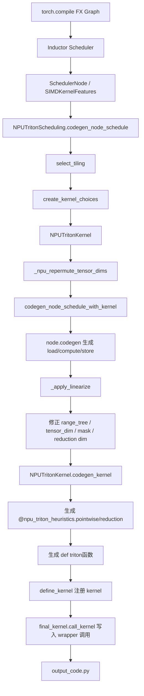
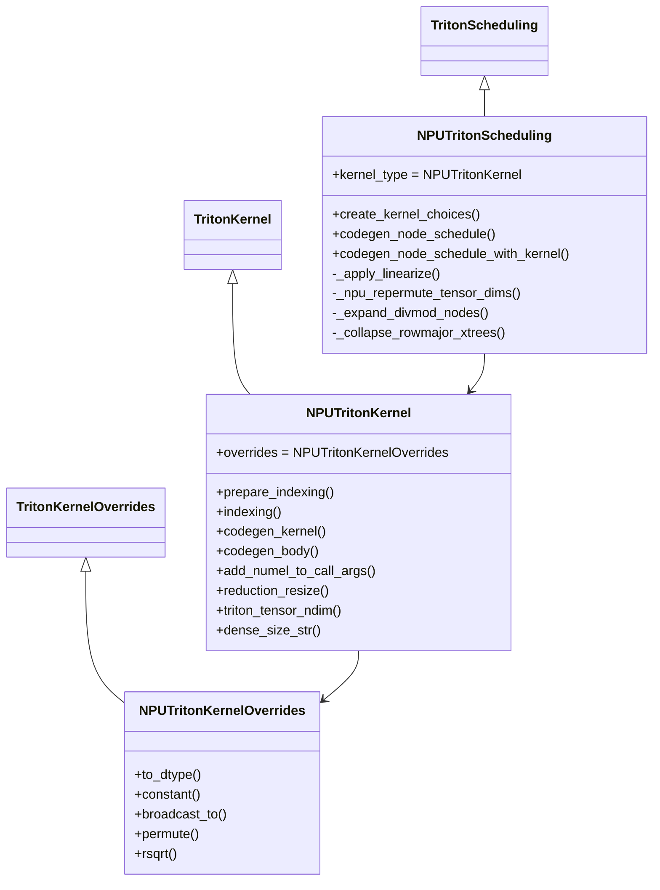
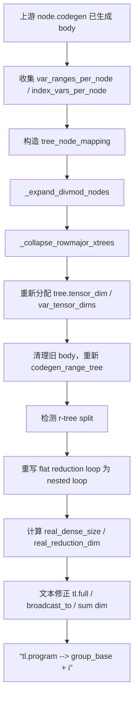
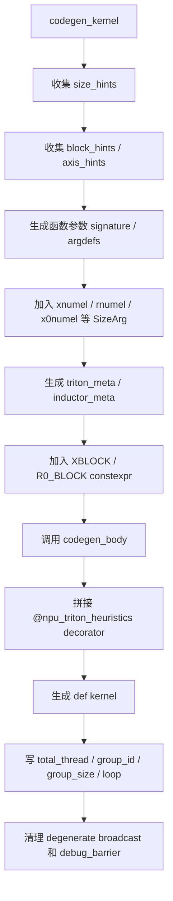

# NPUTritonKernel 与 NPUTritonScheduling 架构导读

> 源码基准：`D:\code\npu_inductor_2.9.0-master\npu_inductor_2.9.0-master\npu_inductor\codegen\triton.py`  
> 关联补丁：`npu_inductor\npu_patch.py`  
> 阅读目标：理解 NPU Inductor 新后端中 Triton 代码生成的核心链路，尤其是 `NPUTritonScheduling` 如何组织 kernel，`NPUTritonKernel` 如何把 Inductor IR 变成最终 `output_code.py` 里的 Triton 算子。

---

## 1. 一句话总览

这两个类的分工可以这样记：

| 类 | 角色 | 核心问题 |
| --- | --- | --- |
| `NPUTritonScheduling` | 调度层 | 哪些 SchedulerNode 放进一个 kernel？什么时候创建 kernel？什么时候做 NPU linearize 后处理？什么时候把 kernel 注册进 wrapper？ |
| `NPUTritonKernel` | 代码生成层 | 一个 kernel 内部如何生成 index、mask、load、compute、store、函数签名、Triton decorator 和最终源码？ |

更短一点：

```text
NPUTritonScheduling 负责“组织 kernel 生成流程”
NPUTritonKernel     负责“生成单个 Triton kernel 源码”
```

---

## 2. 整体调用链



这条链路里，最关键的两个阶段是：

```text
1. codegen_node_schedule_with_kernel
   先让上游 Inductor 的 node.codegen 生成 kernel 内部主体。

2. _apply_linearize
   再把上游生成的通用 Triton 结构改造成 NPU linearize 需要的结构。
```

---

## 3. 类关系图



还有一个容易忽略的外部补丁层：

```text
npu_patch.py 会 monkey patch TritonKernel.codegen_range_tree
```

也就是说，`NPUTritonKernel.codegen_kernel()` 里调用的 `self.codegen_range_tree()`，实际在 linearize 模式下会进入 `npu_patch.py` 里的 NPU 版本。

---

## 4. 入口注册：为什么会走这两个类

文件：

```text
npu_inductor/__init__.py
```

核心注册：

```python
register_backend_for_device(
    "npu",
    NPUTritonScheduling,
    NPUWrapperCodeGen,
)
```

这一步告诉 PyTorch Inductor：

```text
当 device = npu 时，
调度层使用 NPUTritonScheduling，
wrapper 使用 NPUWrapperCodeGen。
```

因此只要 `import npu_inductor` 真正执行成功，后续 `torch.compile(...).to("npu")` 的 Inductor Triton 路径就会进入这里。

---

## 5. NPUTritonScheduling：调度层逐层拆解

源码位置：

```text
npu_inductor/codegen/triton.py:1865
```

### 5.1 类定义

```python
class NPUTritonScheduling(TritonScheduling):
    kernel_type = NPUTritonKernel
```

它继承上游 `TritonScheduling`，但把 kernel 类型换成 NPU 自己的：

```text
上游 TritonScheduling -> TritonKernel
NPU  TritonScheduling -> NPUTritonKernel
```

### 5.2 create_kernel_choices

源码位置：

```text
triton.py:1871
```

代码：

```python
def create_kernel_choices(self, kernel_features, kernel_args, kernel_kwargs):
    return [self.kernel_type(*kernel_args, **kernel_kwargs)]
```

作用：

```text
永远创建 NPUTritonKernel。
```

上游 Inductor 可能会根据特征生成多个候选 kernel，这里 NPU 后端先收敛成一个 NPU kernel 对象，后面的 autotune 主要交给 `npu_triton_heuristics`。

### 5.3 codegen_node_schedule：主入口

源码位置：

```text
triton.py:1875
```

这是 `NPUTritonScheduling` 最重要的方法。

核心流程：

```python
node_schedule = kernel_features.node_schedule

tiling = self.select_tiling(...)
kernels = self.create_kernel_choices(...)

for kernel in kernels:
    self._npu_repermute_tensor_dims(kernel, kernel_features)

for kernel in kernels:
    self.codegen_node_schedule_with_kernel(node_schedule, kernel)

if triton_codegen_linearize:
    self._apply_linearize(kernels[0], node_schedule)

for kernel in kernels:
    src_code = kernel.codegen_kernel()
    kernel_name = self.define_kernel(src_code, node_schedule, kernel)

final_kernel.call_kernel(final_kernel.kernel_name)
```

可以把它分成 7 层：

| 层 | 代码阶段 | 作用 |
| --- | --- | --- |
| 1 | `select_tiling` | 选择上游 Inductor 的基础 tiling/range tree 结构 |
| 2 | `create_kernel_choices` | 创建 `NPUTritonKernel` |
| 3 | `_npu_repermute_tensor_dims` | reduction kernel 中根据内存 stride 调整 tensor_dim 顺序 |
| 4 | `codegen_node_schedule_with_kernel` | 让每个 SchedulerNode 生成 load/compute/store |
| 5 | `_apply_linearize` | NPU linearize 后处理，修正 axis、shape、mask、reduction dim |
| 6 | `kernel.codegen_kernel` | 生成最终 Triton 源码字符串 |
| 7 | `define_kernel` + `call_kernel` | 注册 kernel，并在 wrapper 中写入调用 |

### 5.4 为什么 `_npu_repermute_tensor_dims` 在 body codegen 前执行

源码位置：

```text
triton.py:2503
```

注释里说得很关键：

```text
必须在 codegen_node_schedule_with_kernel 之前运行。
```

原因是 `node.codegen()` 生成 body 时，会直接把 shape 字符串写死到代码里，比如：

```python
tl.full([XBLOCK, R0_BLOCK], ...)
tl.broadcast_to(tmp, [XBLOCK, R0_BLOCK])
tl.sum(tmp, dim)
```

如果 body 已经生成完了，再改 `tree.tensor_dim`，旧字符串不会自动更新，就会产生 shape slot 错位。

所以顺序必须是：

```text
先根据内存 stride 调 tensor_dim
再生成 body
```

这对 reduction 很重要，比如 `sum(dim=0)` 这种 reduction 轴不在最后一维的情况。

### 5.5 codegen_node_schedule_with_kernel：两遍生成

源码位置：

```text
triton.py:3080
```

这个函数重写上游流程，重点是记录每个 node 的 index/range 信息。

结构：

```python
with kernel:
    # 第一遍
    for node in node_schedule:
        node.decide_inplace_update()
        index_vars = kernel.split_and_set_ranges(node.get_ranges())
        all_indexing.update(node._body.indexing_from_args(index_vars).values())

    kernel.finalize_indexing(all_indexing.keys())

    # 第二遍
    for node in node_schedule:
        indexing_dtype_strength_reduction(node._body)
        index_vars = kernel.split_and_set_ranges(node.get_ranges())

        if triton_codegen_linearize:
            kernel.var_ranges_per_node.append(node.get_ranges())
            kernel.index_vars_per_node.append(index_vars)

        node.codegen(index_vars)
```

两遍的意义：

| 第几遍 | 做什么 | 为什么 |
| --- | --- | --- |
| 第一遍 | 收集所有 indexing 表达式，决定 inplace，finalize indexing | 先知道这个 kernel 需要哪些 index 变量、range tree |
| 第二遍 | 真正生成 load/compute/store | 这时 index 体系已经准备好了 |

NPU 额外记录：

```python
kernel.var_ranges_per_node
kernel.index_vars_per_node
```

这些信息后面给 `_apply_linearize` 使用，用来推断：

```text
哪些 x 轴应该拆成 x0/x1/...
哪些节点是 flat node
哪些节点是 decomposition view
```

### 5.6 _apply_linearize：NPU 后处理核心

源码位置：

```text
triton.py:2547
```

这个函数是 NPU 新后端 codegen 中最复杂的一层。它不是从零生成 kernel，而是在上游已经生成出 body 之后，对 kernel 内部结构做二次改造。



它的主要职责有 6 个。

#### 5.6.1 构造 tree_node_mapping

作用：

```text
把原来的 flat 轴和拆出来的子轴建立映射关系。
```

例子：

```text
x2 = x1 * 100 + x0
```

或者：

```text
x0 = flat % 100
x1 = flat // 100
```

这样 body 里原来引用 `x0/x1/x2` 的地方可以继续工作，但 header 里真实迭代的是更适合 NPU 的子轴。

#### 5.6.2 _expand_divmod_nodes

源码位置：

```text
triton.py:1953
```

它检测 body 里是否出现：

```python
y0 // D
y0 % D
```

如果有，就把单个 fused node 拆成：

```text
inner node: length = D
outer node: length = numel / D
```

目标是避免最终 Triton/NPU 后端里出现大量 `%` 和 `//` 地址计算。

#### 5.6.3 _collapse_rowmajor_xtrees

源码位置：

```text
triton.py:2084
```

它做相反方向的优化：如果多个 x 子轴本质上是连续 row-major 的，可以折回一个 flat node。

为什么有时要拆，有时又要合？

```text
拆：为了消除复杂 div/mod，让多维 index 更自然。
合：如果确实是连续扁平访问，1D tile 更容易吃满向量核，避免多维 tile 浪费 lane。
```

当前代码里还特别说明：

```text
pointwise kernel 默认跳过 collapse，
因为 permute/view 类 pointwise 如果折成 flat，可能反而引入慢的 modular arithmetic。
```

#### 5.6.4 重新分配 tensor_dim / var_tensor_dims

作用：

```text
决定每个 x0/x1/r0 在 Triton block tensor 的哪个维度上。
```

排序原则：

```text
divisor 大的轴放外层 slot
divisor 小的轴放内层 slot
```

目的是让 stride-1 的连续轴处在 innermost 位置，帮助 NPU MTE 做连续搬运。

#### 5.6.5 重写 reduction loop

对于被拆开的 reduction tree，代码会设置：

```python
kernel.linearize_info = {
    "tree": tree,
    "inner_node": inner_node,
    "inner_len": inner_len,
    "outer_nodes": outer_nodes,
}
```

然后在 `NPUTritonKernel.codegen_body()` 中使用。

目标：

```text
把一个 flat r-loop 改成 outer scalar loop + inner vectorized loop。
```

概念上：

```python
# 原始形式
for roffset in range(0, rnumel, RBLOCK):
    rindex = roffset + rbase
    r0 = rindex % K
    r1 = rindex // K

# NPU linearize 后
for r1 in range(r1numel):
    for roffset in range(0, r0numel, RBLOCK):
        rindex = roffset + rbase
        r0 = rindex
```

这样可以减少 reduction 内部的 `%` / `//`，也能让 innermost reduction 轴保持 vectorized。

#### 5.6.6 修正 dense shape 和 reduction dim

上游可能生成：

```python
tl.full([XBLOCK, R0_BLOCK], ...)
tl.broadcast_to(tmp, [XBLOCK, R0_BLOCK])
tl.sum(tmp, 1)
```

linearize 后真实 shape 可能变成：

```python
[real_block_x0, real_block_x1, R0_BLOCK]
```

所以 `_apply_linearize` 会做文本修正：

```text
old_dense_size -> real_dense_size
old_reduction_dim -> real_reduction_dim
old_slice -> new_slice
tl.program_id(0) -> group_base + i
```

这是为什么你在 `output_code.py` 里能看到：

```python
real_block_x0
x0_blocks
group_base + i
```

---

## 6. NPUTritonKernel：单 kernel 代码生成层

源码位置：

```text
npu_inductor/codegen/triton.py:424
```

`NPUTritonKernel` 继承自上游 `TritonKernel`，但针对 NPU 做了大量 override。

### 6.1 overrides：接管部分 ops 打印

源码位置：

```text
triton.py:351
```

```python
class NPUTritonKernelOverrides(TritonKernelOverrides):
    ...
```

它负责把 Inductor IR 里的某些 op 打印成 NPU Triton 能接受的形式。

| 方法 | 作用 |
| --- | --- |
| `to_dtype` | NPU 不支持部分 `fp64/int64` compute，降到 `fp32/int32` |
| `constant` | 处理退化 singleton kernel，避免 scalar/block store 类型错误 |
| `broadcast_to` | 支持 NPU patch 引入的 `ops.broadcast_to` |
| `permute` | 打印 `tl.permute` |
| `rsqrt/minimum/maximum` | 直接打印 NPU Triton 支持的 tl op |

### 6.2 __init__：初始化 NPU linearize 状态

源码位置：

```text
triton.py:438
```

核心字段：

```python
self._axis_split_subs = {}
self.npu_per_node_block = False
self.npu_axis_aware_tiling = False
```

并给每个 range tree 加：

```python
tree.tree_node_mapping = {}
```

这些字段后面会贯穿：

```text
prepare_indexing
_apply_linearize
codegen_range_tree
codegen_kernel
```

### 6.3 prepare_indexing：index 表达式进入 kernel 前的清理

源码位置：

```text
triton.py:454
```

流程：

```python
index = super().prepare_indexing(index)
index = self._maybe_split_fused_axes(index)
index = self._simplify_compound_indexing(index)
index = sympy_subs(index, precomputed_replacements)
index = self._fold_trivial_modular_indexing(index)
```

主要做三件事：

```text
1. 发现 x // c 或 x % c，尝试拆 fused axis。
2. 用 range tree 知识简化 ModularIndexing / FloorDiv。
3. 删除实际上不会发生 wrap 的 `%` 或恒为 0 的 `//`。
```

这层的目标不是性能微调，而是让后续 index 表达式更“结构化”，更适合 NPU linearize。

### 6.4 _maybe_split_fused_axes

源码位置：

```text
triton.py:882
```

触发条件：

```python
FloorDiv(sym, c)
ModularIndexing(sym, 1, c)
```

当它发现一个 flat 轴同时被当成：

```text
outer = x // c
inner = x % c
```

就会创建两个子节点：

```text
inner_entry = tree.lookup(parent.divisor, c)
outer_entry = tree.lookup(parent.divisor * c, length / c)
```

然后登记：

```python
tree.tree_node_mapping[parent.name] = outer_sym * c + inner_sym
```

这就是 `x -> x0/x1` 这类结构的来源之一。

### 6.5 indexing：重建 mask 和 broadcast shape

源码位置：

```text
triton.py:1100
```

上游 `TritonKernel.indexing()` 通常会按 prefix 生成比较粗的 mask，比如：

```text
xmask
r0mask
```

NPU linearize 后，每个子轴有自己的 mask：

```text
x0mask
x1mask
x2mask
```

所以这里会根据 `result.index.free_symbols` 重建：

```python
new_mask_vars.add(f"{var.name}mask")
```

最终效果是：

```text
如果 load/store 的地址只依赖 x0，就只带 x0mask。
如果地址依赖 x0 和 x1，就带 x0mask & x1mask。
如果 reduction 外层是 Python scalar loop，就不要错误地带上 inner r-mask。
```

这对 broadcast 和 reduction 很关键，否则会出现形状广播失败或 mask 维度对不上。

### 6.6 triton_tensor_ndim 与 dense_size_str

源码位置：

```text
triton.py:991
triton.py:1005
```

普通上游逻辑：

```text
一个 range tree 对应一个 tensor dim。
```

NPU linearize 后：

```text
一个 x-tree 可能拆成多个 free node：
x0, x1, x2 ...
每个 free node 都可能对应一个 tensor dim。
```

所以：

```python
triton_tensor_ndim()
```

会按 free node 重新计算真实维度数。

`dense_size_str()` 则负责生成类似：

```python
[XBLOCK]
[real_block_x0, real_block_x1]
[real_block_x0, R0_BLOCK]
```

这些 shape 会被用于：

```text
tl.full
tl.broadcast_to
tl.load mask broadcast
reduction accumulator shape
```

### 6.7 reduction_resize / reduction_resize_and_shape

源码位置：

```text
triton.py:1022
triton.py:1051
```

这两个方法处理 reduction 结果的 shape。

典型问题：

```text
reduction 后应该在哪个维度插入 None？
```

如果 reduction 轴在最后：

```python
value[:, None]
```

如果 `_npu_repermute_tensor_dims` 把 reduction 轴挪到了前面：

```python
value[None, :]
```

这就是为什么代码里要根据：

```python
kernel._npu_tile_permuted
r_slots
```

来决定 slice 形状。

### 6.8 iteration_ranges_get_pid

源码位置：

```text
triton.py:1238
```

上游通常用：

```python
tl.program_id(0)
```

NPU linearize 使用 group dispatch：

```python
(group_base + i)
```

所以这里返回：

```python
key = "(group_base + i)"
```

这就是你在 `output_code.py` 里看到：

```python
group_id = tl.program_id(0)
...
for i in range(group_size):
    x0offset = (group_base + i) % x0_blocks * real_block_x0
```

的来源。

### 6.9 codegen_kernel：最终源码生成

源码位置：

```text
triton.py:1251
```

这是 `NPUTritonKernel` 最关键的方法。

它的输出就是最终 `output_code.py` 里的这一整段：

```python
@npu_triton_heuristics.pointwise(...)
@triton.jit
def triton_xxx(...):
    ...
```

可以拆成 9 步：



#### 6.9.1 size_hints / axis_hints

生成：

```python
size_hints = {"x": 400}
axis_hints = [{"name": "x0", "length": -1, "divisor": 1, "seed": 1}]
```

这些会进入：

```python
@npu_triton_heuristics.pointwise(...)
```

给 autotune 和 config 选择使用。

#### 6.9.2 kernel 参数

这里会把普通 tensor 参数、numel 参数、动态子轴参数都放进 signature。

典型：

```python
def triton_xxx(in_ptr0, in_ptr1, out_ptr0, xnumel, x0numel, XBLOCK: tl.constexpr):
```

来源：

```python
SizeArg(f"{tree.prefix}numel", tree.numel)
SizeArg(f"{node.name}numel", node.length)
ConstexprArg("XBLOCK")
```

#### 6.9.3 triton_meta / inductor_meta

`triton_meta` 给 Triton/runtime 使用：

```text
signature
device
constants
mix_mode = "aiv"
configs
block_hints
axis_hints
```

`inductor_meta` 给 Inductor/autotune/debug 使用：

```text
grid_type
kernel_name
mutated_arg_names
num_load
num_reduction
npu_num_x_nodes
autotune flags
```

#### 6.9.4 group dispatch

生成：

```python
total_thread = get_npu_vector_core_count()
group_id = tl.program_id(0)
group_size = total_blocks // total_thread
group_tail = total_blocks % total_thread
group_base = ...
for i in range(group_size):
    ...
```

目的：

```text
把 total_blocks 均匀分给 NPU vector cores。
```

这也是新后端区别于普通 Triton GPU 的一层 NPU 执行模型适配。

### 6.10 codegen_body：reduction loop 重写

源码位置：

```text
triton.py:1608
```

如果没有：

```python
kernel.linearize_info
```

直接走上游：

```python
return super().codegen_body()
```

如果有，就说明 `_apply_linearize` 发现 reduction tree 被拆了，需要生成 nested reduction loop。

结果形态：

```python
for r_outer in range(...):
    for roffset in range(0, r_inner_len, R0_BLOCK):
        rindex = roffset + rbase
        rmask = rindex < r_inner_len
        ...
```

目标：

```text
把外层 reduction 轴变成 Python scalar loop，
把内层 reduction 轴保留为 Triton vectorized block。
```

### 6.11 add_numel_to_call_args：wrapper 调用参数

源码位置：

```text
triton.py:1795
```

`codegen_kernel()` 负责 kernel 函数签名：

```python
def triton_xxx(..., xnumel, x0numel, ...)
```

`add_numel_to_call_args()` 负责 wrapper 里传什么：

```python
triton_xxx_xnumel = ...
triton_xxx_x0numel = ...
triton_xxx.run(..., triton_xxx_xnumel, triton_xxx_x0numel, ...)
```

所以你在 `output_code.py` 里看到：

```python
triton_unk_fused_add_mul_0_xnumel = 4*s27
triton_unk_fused_add_mul_0_x0numel = 4*s27
```

这部分就是从这里来的。

---

## 7. npu_patch.py 与 NPUTritonKernel 的配合

虽然本文主角是 `NPUTritonKernel` 和 `NPUTritonScheduling`，但 linearize 的 header 生成不在 `triton.py` 里，而是在：

```text
npu_inductor/npu_patch.py
```

关键 patch：

```text
npu_patch.py:1119
TritonKernel.codegen_range_tree = _npu_codegen_range_tree

npu_patch.py:1120
TritonKernel.codegen_iteration_ranges_entry = _npu_codegen_iteration_ranges_entry
```

也就是说：

```python
kernel.codegen_range_tree()
```

在 linearize 模式下实际进入：

```python
_npu_codegen_range_tree()
```

### 7.1 _npu_codegen_range_tree

源码位置：

```text
npu_patch.py:352
```

作用：

```text
遍历 range_trees。
对非 reduction tree，用 NPU header generator。
对 reduction tree，保留/修正上游 reduction header。
```

### 7.2 _codegen_header_npu_for_tree

源码位置：

```text
npu_patch.py:420
```

它生成你在 `output_code.py` 里最熟悉的这些变量：

```python
real_block_x0 = ...
x0_blocks = ...
x0offset = ...
x0index = ...
x0mask = ...
xmask = x0mask & x1mask
```

核心逻辑：

| 变量 | 作用 |
| --- | --- |
| `x0numel` | x0 子轴一共有多少元素 |
| `real_block_x0` | 当前 kernel 一次在 x0 上实际处理多少 |
| `x0_blocks` | x0 被切成多少个 block |
| `x0offset` | 当前 block 在 x0 上的起点 |
| `x0index` | 当前 block 内的真实索引 |
| `x0mask` | 当前 block 哪些 lane 有效 |

这就是前面说过的：

```text
numel 是总活
BLOCK 是理论一批最多干多少
real_block 是实际一批干多少
blocks 是分几批
mask 是最后一批哪些位置是真的
```

---

## 8. 以 test_add.py 的 output_code 反推架构

你的 `test_add.py` 是：

```python
return z + (y + x * z) * (x + y) + 0.22111
```

输入：

```text
[4, 100]
```

总元素：

```text
4 * 100 = 400
```

在 output_code 中：

```python
@npu_triton_heuristics.pointwise(
    size_hints={'x': 400},
    ...
)
def triton_unk_fused_add_mul_0(
    in_ptr0, in_ptr1, in_ptr2, out_ptr0,
    xnumel, x0numel,
    XBLOCK: tl.constexpr
):
```

它对应的架构来源是：

| output_code 片段 | 来源 |
| --- | --- |
| `@npu_triton_heuristics.pointwise` | `NPUTritonKernel.codegen_kernel()` |
| `size_hints={'x': 400}` | `codegen_kernel()` 收集 `self.numels` |
| `xnumel` | `codegen_kernel()` 为 x-tree 加 `SizeArg("xnumel")` |
| `x0numel` | linearize 后 free node `x0` 的动态长度参数 |
| `XBLOCK` | `codegen_kernel()` 为 tensor_dim 加 constexpr block 参数 |
| `real_block_x0` | `npu_patch.py::_codegen_header_npu_for_tree()` |
| `x0mask` | `npu_patch.py` header + `NPUTritonKernel.indexing()` mask 重建 |
| `group_base + i` | `NPUTritonKernel.iteration_ranges_get_pid()` + `codegen_kernel()` group loop |

整体就变成：

```text
400 个元素
  -> x0numel = 400
  -> XBLOCK 是 autotune 给的一批最大元素数
  -> real_block_x0 = min(x0numel, XBLOCK)
  -> x0_blocks = ceil(400 / real_block_x0)
  -> total_thread 个 vector core 分摊这些 blocks
```

---

## 9. 从源码阅读时建议按这个顺序

不要从文件头一路读到文件尾，容易陷进去。建议按链路读：

```text
1. __init__.py
   看 register_backend_for_device，确认 NPU 后端入口。

2. triton.py:1865 NPUTritonScheduling
   先看 codegen_node_schedule，理解总流程。

3. triton.py:3080 codegen_node_schedule_with_kernel
   看 SchedulerNode 如何真正生成 body。

4. triton.py:2547 _apply_linearize
   看 NPU 后处理如何修改 range tree、shape、reduction。

5. triton.py:424 NPUTritonKernel
   看单 kernel 的 index/mask/body/codegen 细节。

6. triton.py:1251 codegen_kernel
   对照 output_code.py 看函数签名、decorator、group loop。

7. npu_patch.py:352 / 420
   看 real_block_x0、x0_blocks、x0mask 是怎么生成的。
```

---

## 10. 调试时最有用的观察点

### 10.1 如果 output_code 里 shape 不对

重点看：

```text
_apply_linearize
triton_tensor_ndim
dense_size_str
reduction_resize_and_shape
```

尤其是：

```text
old_dense_size -> real_dense_size
old_reduction_dim -> real_reduction_dim
```

### 10.2 如果 mask 维度不对

重点看：

```text
NPUTritonKernel.indexing
npu_patch.py::_codegen_header_npu_for_tree
tree.var_tensor_dims
tree.tree_node_mapping
```

### 10.3 如果出现大量 // 和 %

重点看：

```text
prepare_indexing
_maybe_split_fused_axes
_simplify_compound_indexing
_expand_divmod_nodes
_collapse_rowmajor_xtrees
```

### 10.4 如果 reduction 很慢

重点看：

```text
_npu_repermute_tensor_dims
_npu_order_trees_by_stride
codegen_body
_rewrite_flat_r_loop_inplace
reduction_resize_and_shape
```

### 10.5 如果 wrapper 调用参数不匹配

重点看：

```text
codegen_kernel 里的 signature/argdefs
add_numel_to_call_args
SizeArg / ConstexprArg
```

---

## 11. 最小心智模型

可以把整个 NPU Triton codegen 想成三层：

```text
第一层：上游 Inductor 生成通用 kernel body
  SchedulerNode.codegen
  load / compute / store

第二层：NPU linearize 修正结构
  range_tree
  tensor_dim
  tree_node_mapping
  dense shape
  reduction dim
  group dispatch

第三层：NPU Triton 源码落盘
  @npu_triton_heuristics
  def triton_xxx(...)
  real_block_x0 / x0_blocks / x0mask
  tl.load / tl.store
```

对应两个核心类：

```text
NPUTritonScheduling
  负责第一层和第二层之间的调度编排。

NPUTritonKernel
  负责第二层到第三层的具体源码生成。
```

---

## 12. 你后续适配算子时应该重点盯什么

如果你要适配 GroupNorm、LayerNorm、broadcast、permute、slice 这类算子，建议每次都回答这几个问题：

```text
1. FX 图里最终有哪些 aten/prims ops？
2. lowering 后是 pointwise、reduction，还是 fallback？
3. node_schedule 里是否有 reduction pass？
4. range_trees 里 x/r 被拆成了哪些 node？
5. output_code 里 x0numel、real_block_x0、R0_BLOCK 是否合理？
6. mask 是 xmask 还是 x0mask/x1mask 的组合？
7. tl.sum/tl.max 的 dim 是否对应真实 reduction 轴？
8. wrapper 传入的 numel 是否和 kernel 签名一致？
```

这几个问题基本覆盖了 `NPUTritonScheduling` 和 `NPUTritonKernel` 的主要职责边界。

